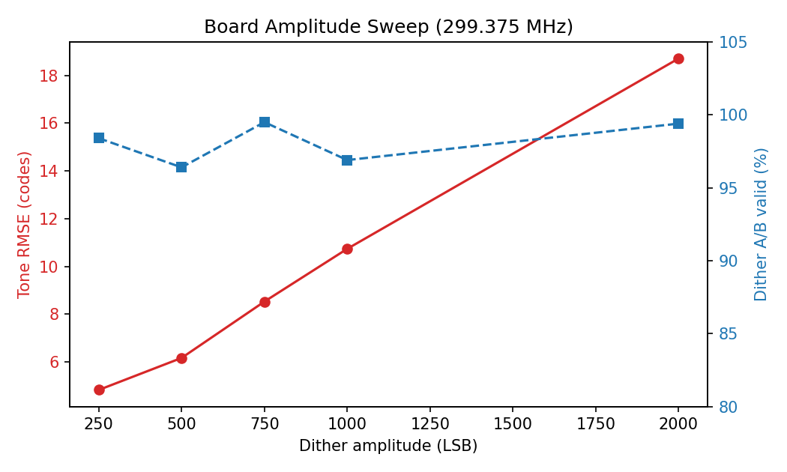
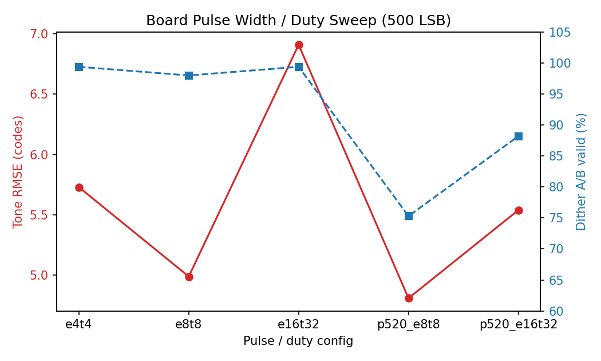

# TIADC Impulse Dither — Board Sweep Update

**To:** Professor Xilin Liu
**Date:** 2026-08-25
**Scope:** Two additional board-level sweeps (impulse amplitude, pulse width / duty cycle) on the existing TIADC calibration bench.

---

## Key Findings

1. **Selling point 1 is now stronger on hardware.**
   - A 12-DAC-sample pulse at 4.6% duty was still detected with **99.4% validity** on the board.
   - Across 250–2000 LSB, event detection remained reliable (96–99%).

2. **There is a clear amplitude / duty trade-off.**
   - Higher dither amplitude increasingly degrades the tone fit (tone RMSE rises from ~4.8 to ~18.7 codes at 2000 LSB).
   - Overly sparse pulses reduce detection reliability (period 520 DAC: 75–88% valid).

3. **Selling point 2 remains unchanged.**
   - Dither fine-skew and gain are still not recovered; dither fine-skew validity is near 0–3% across all board runs.

---

## Amplitude Sweep (Board)

| Amplitude (LSB) | Tone RMSE (codes) | Dither A/B Valid |
|---:|---:|---:|
| 250 | 4.83 | 98.4% |
| 500 | 6.17 | 96.4% |
| 750 | 8.53 | 99.5% |
| 1000 | 10.74 | 96.9% |
| 2000 | 18.71 | 99.4% |

---

## Pulse Width / Duty Sweep (Board)

| Config | Pulse (DAC) | Duty | Tone RMSE (codes) | Dither A/B Valid |
|---|---:|---:|---:|---:|
| e4t4 | 12 | 4.6% | 5.73 | 99.4% |
| e8t8 | 24 | 9.2% | 4.99 | 98.0% |
| e16t32 | 64 | 24.6% | 6.91 | 99.4% |
| p520_e8t8 | 24 | 4.6% | 4.81 | 75.3% |
| p520_e16t32 | 64 | 12.3% | 5.54 | 88.2%* |

\* `p520_e16t32` run was incomplete; performance CSV was not exported.

---

## Implication for Publication / Next Decision

- The **first selling point** (low-cost, minimally intrusive impulse) now has direct board-level evidence:
  - very narrow and low-duty impulses remain reliably detectable;
  - the main tone is only mildly disturbed at low-to-moderate amplitudes.
- The **second selling point** should stay framed as limited / dispersion-constrained.
- Recommended discussion at the September meeting:
  - whether to pursue a hardware coupling demo;
  - whether to start writing the system/measurement paper now.

---

## Suggested Short Email Message

> Hi Professor Liu,
>
> I completed two additional board-level sweeps on impulse amplitude and pulse width/duty cycle. The results strengthen the first selling point: very narrow, low-duty impulses remain reliably detectable with little disturbance to the tone, while overly sparse pulses reduce detection reliability. I am putting the results into a short one-page summary and can send it before our September meeting.
>
> Best,
> [Your name]
