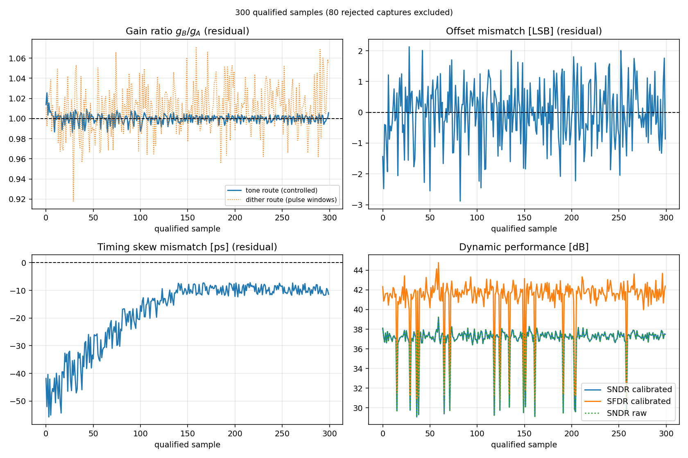
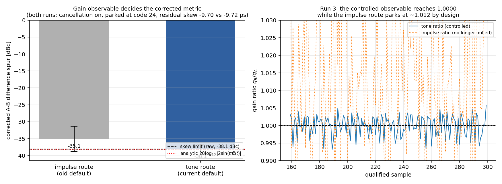

# TIADC Impulse Dither — Closed-Loop Calibration Update

Research update for Professor Liu | 17 September 2026

## Key Takeaway

The impulse-dither calibration loop now closes **end-to-end on hardware** and the result
matches theory: the A−B channel-difference spur falls from **−24.5 dBc to −38.1 dBc**,
reproducing the analytic `20log10|2 sin(pi f dt)|` to **0.27 dB**, with all three axes
(gain, offset, skew) converged simultaneously from the same captures. Two findings change
the picture from the 27 August update. **(1) The "offset observability is limited" result
is retracted** — the 3–4 code figure was the channel DC mismatch the loop is correcting,
not a disagreement between estimators; measured properly, the impulse-derived offset agrees
with two independent whole-record estimators to **0.07 codes**. **(2) Dither gain cannot
drive a gain loop, and that is now quantified** — the pulse window carries 2.3 % per-frame
scatter and sits 1.2 % away from the in-band tone, so the loop integrates the tone instead.
The impulses' demonstrated role is **alignment and offset**; gain and skew absolutes come
from the in-band tone available in the same capture.

## 0. Status at a glance

| item | status |
|---|---|
| Closed loop, three axes, one excitation | **done** — converged, theory-matched to 0.27 dB |
| Impulse dither's demonstrated role | **alignment + offset** (offset now verified unbiased to 0.07 codes) |
| Gain and skew absolutes | **from the in-band tone** in the same capture |
| Repeatability | **4 runs**, including one after a board re-bring-up from a different start |
| Stability of the converged state | **+0.01 ps/min** over 340 s, read-only |
| True 2x interleaving | **not done** — parallel geometry; needs ~384.6 ps of external path offset |
| On-chip / background implementation | **not done** — corrections are host-side, only skew is written to hardware |
| Bandwidth axis | **not started** — one lead, see section 4 |
| Passive coupling into a mission signal path | **not done** — injection is DAC-synthesized, unchanged since 27 Aug |

## 1. The closed loop, as measured

| | value | how it was measured |
|---|---|---|
| A−B difference spur (raw channel difference) | **−38.13 ± 1.41 dBc** | 141 post-convergence samples, 300 qualified |
| analytic prediction from the residual skew | −38.39 dBc | `20log10\|2 sin(pi f dt)\|`, f = 199.375 MHz, dt = 9.72 ps |
| gap to prediction | **+0.27 dB** | — |
| corrected channel difference | −38.12 ± 1.43 dBc | host gain/offset correction applied |
| residual skew | −9.72 ± 1.43 ps | batch mean, 20 frames per decision |
| residual offset mismatch | −0.05 to −0.18 codes | signed mean; three independent routes agree |
| residual gain mismatch at f_in | 0.076 % | applied correction ratio |

The loop ran unattended for **300 qualified samples from 380 captures** (80 rejected, 21 %,
almost all torn UDP frames), moved the delay actuator **8 codes with every firmware
transaction ACKed `result=OK`**, and left no frozen or repeated frames (380/380 distinct).

A read-only stability pass at the converged point (7 rounds, 340 s) shows the state holds:
drift **+0.01 ps/minute** (slope uncertainty ±0.20 ps/min) and a spur spread of 0.57 dB.
No periodic re-convergence is needed on a minutes timescale.

## 2. Correction: offset observability is not limited

The 27 August update carried "offset separation is weak (3–4 codes, unstable across runs)".
That number is the **channel DC mismatch itself** — the quantity the loop spends its time
removing — not a disagreement between estimators. Measured on 40 archived captures from the
converged state, three routes to that same mismatch agree:

| route | reading |
|---|---|
| impulse window, flat-top, polarity-decoupled (what the loop integrates) | −3.907 codes |
| whole-record tone-fit DC | −3.975 codes |
| plain record mean | −3.977 codes |

Agreement **0.07 codes** (1.8 % of the 3.9-code mismatch), per-frame correlation **+0.92**.
After convergence the signed residual is ~0.1 codes. The impulse polarity sequence is
balanced and the window estimator decouples the residual leak exactly, which is why a
low-energy pulse can carry an unbiased DC measurement — the same property that makes the
alignment work. Reproduce: `calibration_out/_offset_routes_test.py`.

## 3. Dither gain cannot drive a gain loop — quantified

Two independent estimates of one gain mismatch disagree on this bench:

| route | value | per-frame scatter |
|---|---|---|
| impulse amplitude (pulse windows) | 1.010–1.014 (**1.1–1.4 % high**) | 2.3 % |
| coherent main tone | 1.0004–1.0010 (−62 to −67 dBc) | **0.25 %** |

The disagreement is reproducible (t = −2.7 to −3.3 over three runs) and the tone route is
~10× quieter. Closing the loop on the impulse route seated the correction 1.1–2.05 % away
from the point that nulls the tone, which **capped the corrected metric at −35.1 dBc** while
the raw one reached −38.6 dBc. Switching the controlled observable to the tone route
(`gain_observable`, now the default) moved the corrected spur to −38.12 dBc and the
applied-ratio term from −38.0 dBc to −62.4 dBc; the per-frame error model that predicted
this closes to 0.25 dB and its correlation with the measurement rose from 0.69 to 0.96.
The offline model reproduces both regimes (+8.9 dB from the change alone), so the effect is
attributable to the observable choice and not to run-to-run variation.

This is consistent with the firmware's own behaviour and refines the view that its dither
path simply does not run. It does run — alignment and event detection succeed on every
frame — but its **impulse-derived gain and skew estimates are rejected by their own quality
gates** (gain: 59 of 60 evaluated frames flagged `FIT_QUALITY`, values 0.39–0.57; skew: 189
of 190 frames, edge disagreement 0.2–592 ps against a 23 ps gate), so the pipeline that
converges does so by using the impulses for alignment only, taking gain from a waveform fit
and skew from the tone phase. The host-side loop reported here reaches the same conclusion
from independent measurements, and additionally shows what the impulses *are* good for:
alignment and offset, from the same capture that supplies the tone.

Both runs in the left panel are comparable in every other respect — cancellation on, parked
at code 24 first, and converging to the same residual skew (−9.70 vs −9.72 ps) — so the
difference is attributable to the observable alone. The pre-fix value is recomputed from the
300-sample curve recovered from that run's console log, and it reproduces the statistic
measured on the original CSV before it was overwritten (−35.07 ± 3.69 against
−35.07 ± 3.66 dBc), which also cross-checks the recovery.

## 4. Status of the selling points

**Selling point 1 (cheap impulses, easy to inject, no ramps).** Strengthened. The closed loop
works with pulses whose measured replica is 17.8 codes against a 557-code tone — **3.2 % at
the ADC, i.e. ≈−30 dB** (the DAC-domain pulse is ~7 % of the sine peak): alignment, deframing,
the polarity anchor and the offset estimate all come from them, and offset is now shown to be
unbiased. The coupling argument
itself is still not demonstrated — as before, the waveform is synthesized in the DAC, so
independent passive coupling into an otherwise unmodified signal path remains the open
demonstration.

**Selling point 2 (simultaneous gain, offset, skew, bandwidth).** Partly achieved, with a
precise boundary. **Simultaneous** is now real: every capture updates gain and offset
per frame and feeds the batch skew decision, and all three axes converged in one run from
one excitation. But the *absolute* gain and skew estimates come from the in-band tone, not
from the pulses; the impulses contribute alignment and offset (plus an independent
cross-check on skew). **Bandwidth is still not addressed** — there is no bandwidth estimator
or loop in either implementation, and dispersion continues to appear as an error source
rather than a target. The one concrete lead is that the 1.2 % impulse-vs-tone amplitude
difference *is* a channel-response difference at one frequency; turning it into a bandwidth
estimate needs either a second frequency point or a pulse-shape fit. Its mechanism
(dispersion vs estimator bias) is not yet determined, so this is a hypothesis, not a result.

## 5. Method-level findings worth consolidating

1. **Observable choice decides the outcome.** Two valid estimates of one mismatch differed by
   1.2 %; looping on the wrong one capped the corrected metric 3.5 dB below the raw one. Any
   dither-based loop should state which observable it closes on and report the other.
2. **A quantized actuator needs a batch decision.** One delay code moves ~4.8 ps, more than the
   converged residual, so per-frame integration chases noise; 20-frame batches with a deadband
   and a direction check converged repeatably (four runs, including after a board re-bring-up
   from a different starting point).
3. **The degradation curve is analytic.** Measured spur against residual skew follows
   `20log10|2 sin(pi f dt)|` to 0.22–0.30 dB across runs, which is what lets the residual be
   attributed rather than merely observed.

## 6. Honest limitations

- **Parallel, not interleaved.** Channels A and B sample the same instant; the metric is the
  A−B difference spur. True 2× interleaving needs a ~384.6 ps path offset against a 363 ps
  on-chip delay range, i.e. an external delay change.
- **Corrections are applied host-side.** Only skew is written to hardware; gain and offset
  corrections are applied to captured records. This validates the algorithm, not an on-chip
  background implementation.
- **Deadband-limited headline.** The converged residual is quantized by the ~4.8 ps step and
  our 10 ps deadband is twice that; the same hardware demonstrably holds ~1 ps when the code
  lands well (predicted ≈ −57 dBc). Tightening the deadband to 3–4 ps should reach
  −46 to −50 dBc in one further run.
- **No bandwidth axis**, as above.

## 7. Decisions requested

1. Is the closed-loop result (theory-matched, three axes, four repeat runs) sufficient to
   begin consolidating toward publication, with the parallel-geometry and host-side
   boundaries stated explicitly?
2. Should the next hardware step be the true-interleaving change (~8 cm of coax in one
   channel path, ~1–2 days including offline verification), or the deadband refinement that
   buys ~8–12 dB on the current metric for a few minutes of bench time?
3. For selling point 2, is the bandwidth axis worth pursuing via a two-frequency extension of
   the impulse excitation, given that the collaborators flagged it as the interesting one?

Data note: every number above is recomputed from committed artifacts —
`calibration_out/closed_loop/run3_gainfix.csv` (300 qualified samples, 380 captures) and the
recovered 300-sample curve `run1_300_from_log.csv`; the offset agreement from 40 archived
captures (`calibration_out/dither_vs_tone_frames/`); stability from a read-only 340 s pass.
The firmware comparison comes from the exported CSVs of the 14:51 run
(`adc_data/calibration_exports/calibration_run_20260917_145113/`). The earlier 3–4 code
offset figure is annotated as corrected in `TIADC_CALIBRATION_LOOP_ERROR_ANALYSIS_EN.md`.
