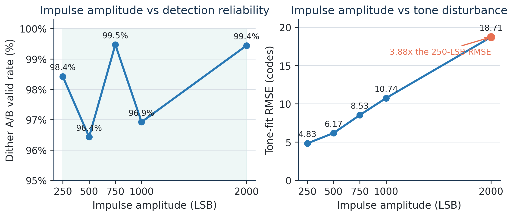
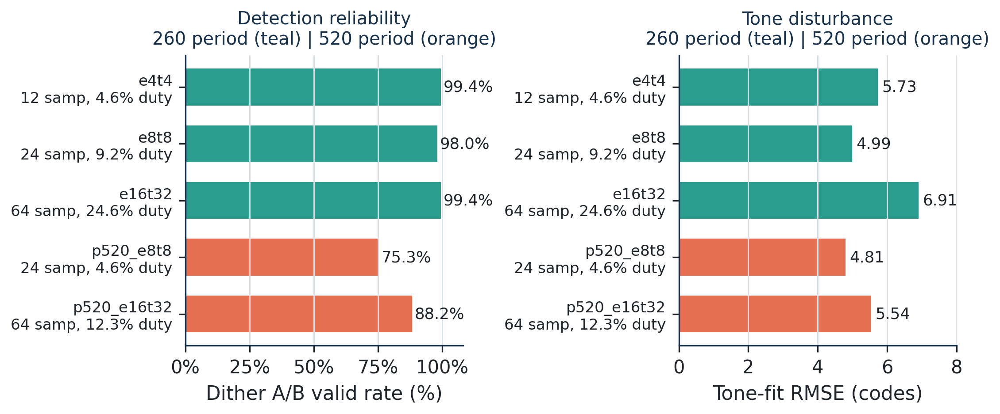

# TIADC Impulse Dither - Board-Level Operating-Region Update

Research update for Professor Liu | 27 August 2026

## Key Takeaway

Board-level sweeps show that sparse, low-amplitude impulse excitation can remain reliably detectable while introducing limited disturbance to the tone signal. Very narrow pulses are viable, but excessively sparse repetition reduces detection reliability. These results strengthen the practical impulse-injection selling point, while the previously identified gain and fine-skew limitations remain unchanged.

## 1. Board-Level Amplitude Sweep

Across 250-2000 LSB, the measured dither A/B valid rate remains 96.4-99.5%, while mean timing correlation remains 0.99881-0.99993. Detection therefore remains strong throughout the tested range. The cost of stronger injection is visible in the tone fit: mean RMSE increases from 4.83 codes at 250 LSB to 18.71 codes at 2000 LSB, an increase of 13.89 codes or 3.88x.

The sweep identifies a broad low-disturbance operating region rather than a single globally optimal amplitude. Larger impulses are not necessarily better.

## 2. Board-Level Pulse / Duty Sweep

At the standard 260-DAC-sample repetition period, the 12-sample pulse occupies only 4.6% of the waveform and still gives 99.4% validity. The 24- and 64-sample cases give 98.0% and 99.4%, respectively. When the period is doubled to 520 samples, validity falls to 75.3% for the 24-sample pulse and 88.2% for the 64-sample pulse, despite comparable tone-fit RMSE. Impulses can therefore be narrow and low-duty, but repetition should not be made arbitrarily sparse.

`p520_e16t32` has no `calibration_performance.csv`; no final-skew or Stage 5 value is assigned to it.

## 3. Implication for Selling Point 1

Current evidence supports sparse impulse generation, reliable recovery through the existing real DAC-to-ADC chain, low temporal occupancy, and a measurable trade-off between injection strength and tone disturbance. It does not yet demonstrate independent passive coupling into an otherwise unmodified mission-signal path. The remaining publication-level decision is whether the present evidence is sufficient or whether a later independent coupling demonstration should be added.

## 4. Status of Selling Point 2

Event detection is strong. Offset observability remains limited; dither gain has no stable calibration factor; fine-skew is unreliable under measured dispersion; bandwidth calibration was not pursued. Tone-based calibration remains the stable main path. No successful three-parameter separation is claimed.

## 5. Decisions for the September Meeting

1. Are the current board-level results sufficient to begin consolidating the work toward publication?
2. Should the next hardware step focus specifically on an independent passive-coupling demonstration to strengthen selling point 1?
3. What should be the scope and division of work for the additional FPGA student?

Data note: all ten summary rows were independently recomputed from the committed timing, skew, and performance CSVs. Stage 5 is available for nine runs. Per-run means of its calibrated parallel-average metrics span 33.90-45.58 dB SNDR, 32.80-53.96 dB SFDR, and 5.34-7.28 bits ENOB. These ranges are included for provenance, not as evidence of dither-based calibration. Duty is derived as pulse length divided by repetition period; validity percentages and Stage 5 ranges are arithmetic means of recorded CSV fields. No new board tests were run.
